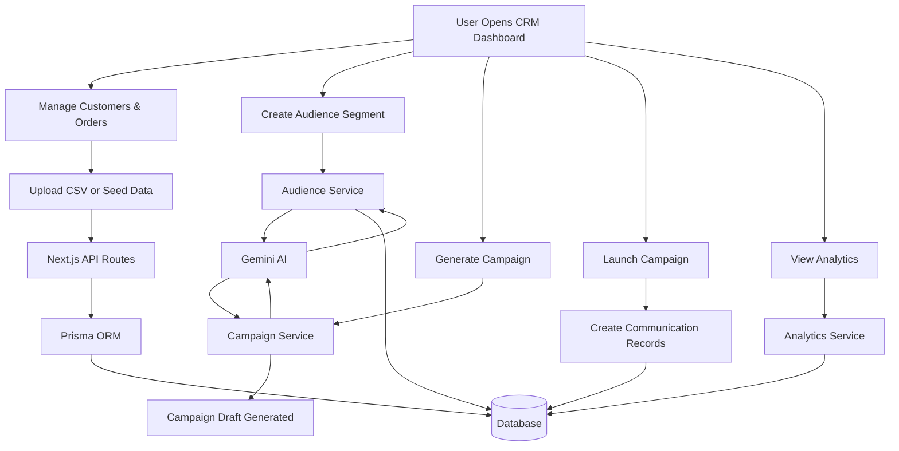
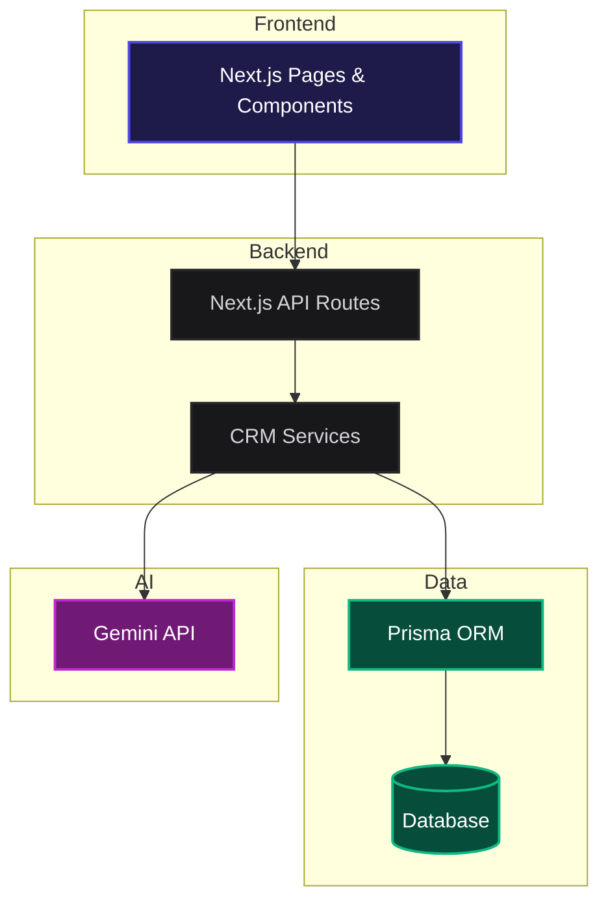
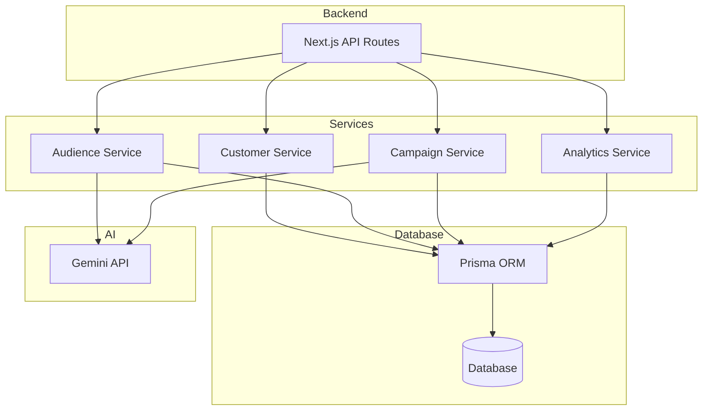
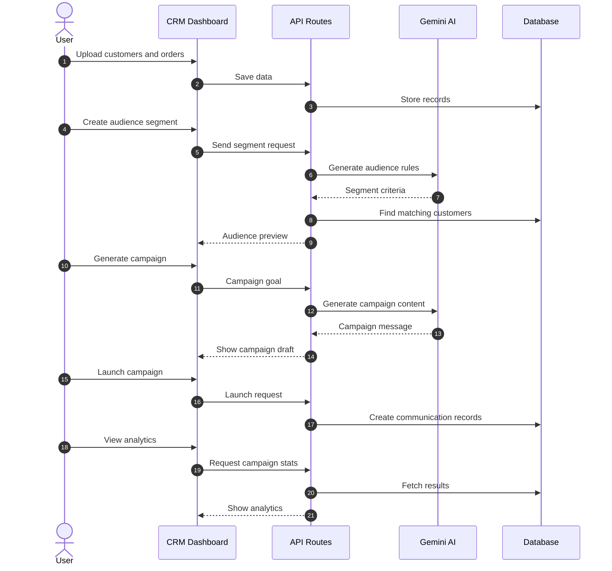

# AI-Native Mini CRM

A simple AI-powered CRM built using Next.js, Prisma, and Gemini AI.

The application helps marketers manage customer data, create audience segments, generate campaigns using AI, launch campaigns, and track performance from a single dashboard.

---

# Features

## Dashboard

- View total customers, orders, revenue, and campaign statistics
- See recently added customers and orders
- Seed or reset sample data for testing

## Customers & Orders

- View customer and order data
- Upload customer and order CSV files
- Store data in the database using Prisma

## Audience Segments

- Create audience groups using filters
- Generate audience segments using Gemini AI
- Preview matching customers instantly

## Campaign Generator

- Enter a campaign goal
- Generate campaign messages using Gemini AI
- Get suggested communication channels

## Campaign Launch

- Launch campaigns for selected audiences
- Create communication records
- Track delivery status

## Analytics

- View campaign performance
- Monitor engagement and delivery metrics
- Analyze campaign results

---

# Tech Stack

- Frontend: Next.js 15 + React
- Styling: Tailwind CSS
- Database: Prisma ORM
- AI: Google Gemini API
- CSV Processing: PapaParse
- Deployment: Vercel

---


---

# System Flow



---

# High-Level Architecture



---

# Detailed Architecture



---

# Campaign Flow



---

# API Endpoints

| Method | Endpoint | Purpose |
|----------|----------|----------|
| GET | `/api/dashboard/stats` | Get dashboard statistics |
| POST | `/api/dashboard/seed` | Seed sample data |
| POST | `/api/dashboard/reset` | Reset database |
| POST | `/api/upload/customers` | Upload customer CSV |
| POST | `/api/upload/orders` | Upload order CSV |
| POST | `/api/segmentation` | Generate audience segment |
| POST | `/api/campaign` | Generate or launch campaign |
| GET | `/api/campaign?type=metrics` | Get campaign analytics |

---

# Project Structure

```text
src
├── app
│   ├── dashboard
│   ├── customers-orders
│   ├── audience-segments
│   ├── campaign-engine
│   ├── analytics
│   └── api

├── components
│   ├── dashboard
│   └── ui

├── services
│   ├── customer
│   ├── audience
│   ├── campaign
│   └── analytics

├── prisma
│   ├── schema.prisma
│   └── seed.js
```

---

# Setup

## 1. Create Environment File

```env
GEMINI_API_KEY=your_gemini_api_key
DATABASE_URL=your_database_url
```

## 2. Install Dependencies

```bash
npm install
```

## 3. Setup Database

```bash
npx prisma db push
npx prisma db seed
```

## 4. Start Application

```bash
npm run dev
```

Open:

```text
http://localhost:3000
```
