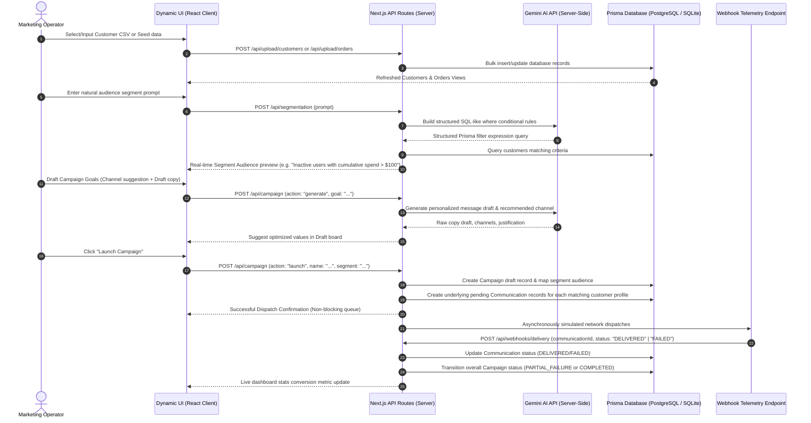
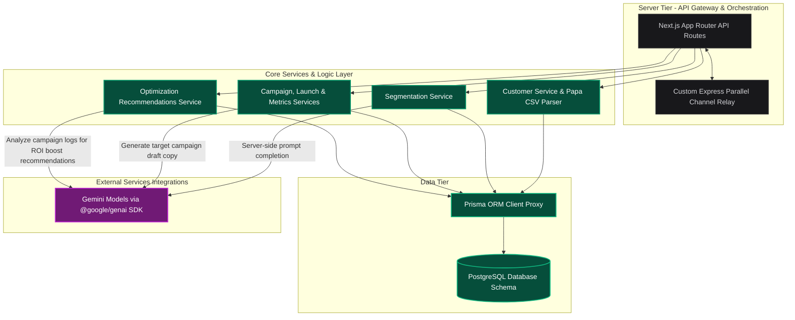

# AI-Native Crm

Ai-native mini crm build using next.js for both frontend and backend.


## 🚀 Key Architectural Features & Modules

### 📊 1. Executive Analytics Gateway (`/dashboard`)
*   **Dynamic Revenue Funnel**: Displays active shoppers, real-time invoices, transacted gross revenue, and communication delivery success index.
*   **Hot Database Tables**: Direct previews of database updates in real-time, showing recently registered profiles and inbound transactions.
*   **System Actions Control**: Ability to reset and seed the database instantly to clean up and simulate live environments.

### 👥 2. Customer & Invoices Portal (`/customers-orders`)
*   **Live Data Sync**: Dedicated overview grid of all active consumers, complete with demographic analytics and full transaction tallies.
*   **CSV Processing Engine**: Integrated with `papaparse` to accept file drops or manual uploads of bulk customer and invoice directories, parsed instantly on the server.

### 🎭 3. Intelligent Audience Segmenter (`/audience-segments`)
*   **Flexible Group Rules Builder**: Group consumers dynamically using structured properties like total spend, sign-up dates, or purchase intervals.
*   **AI Agent Segmentation**: Leverages background server-side JSON agents to identify rich behavioral patterns and extract high-value loyalty tiers automatically.

### 🧠 4. Dynamic Campaign Composer (`/campaign-engine`)
*   **Contextual Copy Editor**: Input overarching campaign goals and let deep AI reasoning translate them into personalized copy tailored directly to each segment's behavioral attributes.
*   **Predictive Channel Placement**: Evaluates and suggests the best messaging channels (Email, SMS, Push, WhatsApp) based on target user engagements.

### 📡 5. Message Terminal & Simulator (`/campaign-execution`)
*   **Interactive Dispacher**: Simulate live campaign launches and observe automatic packet dispatches.
*   **Live Webhook Deliveries**: Evaluates response codes (Delivered ➔ Read ➔ Engaged) to mirror actual consumer behavior and log statistical feedback.

### 📈 6. Conversion Analytics Suite (`/analytics`)
*   **Performance Metrics**: Follows performance trends with interactive completion gauges, engagement ratios, and live status charts showing real-time feedback loop.

---

## 🛠️ The Tech & AI Stack

*   **Framework**: Next.js 15+ (App Router) with Server-Side React rendering.
*   **Layout & Aesthetics**: Tailwind CSS v4, customized variables support.
*   **Animation System**: Framer Motion (`motion/react`).
*   **Database Engine**: Prisma ORM with multi-database driver flexibility.
*   **AI Service Core**: Server-side Google GenAI (`@google/genai`) orchestrating segmentation and context optimization pipelines.
*   **Integration Services**: Custom Express parallel broker handles real-time webhooks and telemetry relays.

---

## 🛰️ Quickstart Guide

### 1. Environment Configuration
Create a `.env` file in the root directory (using `.env.example` as a template):
```env
GEMINI_API_KEY=your_google_gemini_api_key_here
DATABASE_URL=your_prisma_target_database_url
```

### 2. Install Project Dependencies
Verify and populate all node packages using the workspace package manager:
```bash
npm install
```

### 3. Initialize & Seed Database Schema
Push the structural schema definitions directly to your local database resource and seed the inicial mock dataset:
```bash
npx prisma db push
npx prisma db seed
```

### 4. Direct App Execution
CRM is fitted with an orchestrated multi-process launcher starting both the core Express channel relays and Next.js development threads simultaneously:
```bash
npm run dev
```
Open [http://localhost:3000](http://localhost:3000) inside your browser to access the active ecosystem.

---

## 📊 End-to-End System Flow



### 🔁 Flow Progression Explained
1.  **Ingestion Phase**: Demographics and historical invoices are loaded into the relational schema. Operators can upload custom spreadsheets at `/customers-orders` or tap **Quick Start** to seed records.
2.  **Semantic Cohort Isolation**: The `SegmentationService` translates descriptive operator guidelines into precise DB criteria filter models natively utilizing the server-side Gemini cognitive loop.
3.  **Creative Optimization**: Real-time content copies are generated matching the underlying segment profiles, with channel strategies (SMS, Email, Push) tailored based on historical feedback.
4.  **Simulation & Loopback Propagation**: Campaign launches initiate a non-blocking asynchronous pipeline registering communications across target accounts. Automated telemetry webhooks callback with delivery confirmations to compute real-time analytical funnels.

---

## 🏗️ Technical Architecture



### 🖼️ Architectural Design Decoupling
*   **Context Sync Gateway**: Clients tap into the application state via the standard React context API wrapper (`CrmDataProvider`), enabling silent telemetry updates, responsive list updates, and smooth skeleton load states across individual routing pages.
*   **Asynchronous Processing**: High-latency customer notifications run on a separated parallel dispatch engine thread without clogging client feedback times or active database connections.
*   **Standardized ORM**: Domain model boundaries are decoupled from raw storage tables via Prisma ORM adapters, making migrations from sandbox development files into PostgreSQL rapid and seamless.

---

## 📡 Live API Gateway Reference

| HTTP Method | Route Pathway | Access Protocol | Primary Objective | Key Payload Elements |
| :--- | :--- | :--- | :--- | :--- |
| **GET** | `/api/dashboard/stats` | JSON Payload | Pull executive summary indexes and list-previews of recently committed items. | None |
| **POST** | `/api/dashboard/seed` | Trigger Handler | Repopulate 1,000 customers and 3,000 orders to recreate full operational histories instantly. | None |
| **POST** | `/api/dashboard/reset` | Truncate Task | Securely purge all tables in proper relational cascading sequence. | None |
| **POST** | `/api/upload/customers` | CSV Parse Stream | Process raw client tables and perform transactional batch updates to the database. | `{ csv: "string" }` |
| **POST** | `/api/upload/orders` | CSV Parse Stream | Process raw transaction databases, mapping order records directly against matched profiles. | `{ csv: "string" }` |
| **POST** | `/api/segmentation` | LLM Mapping | Convert natural speech suggestions into safe SQL/Prisma where criteria queries using Gemini. | `{ prompt: "string" }` |
| **POST** | `/api/campaign` | Content Builder | Orchestrate multi-action draft updates: copy optimization, draft logging, or live non-blocking queues. | `{ action: "generate"\|"save"\|"launch", ... }` |
| **GET** | `/api/campaign?type=metrics` | Analytical Query | Group complete campaign event dispatches, webhook returns, and funnel conversions. | None |
| **GET** | `/api/optimization` | Context Analytics | Evaluate historical dispatches to produce strategic copywriting recommendations and channel tips. | `?campaignId=string` |
| **POST** | `/api/webhooks/delivery` | Telemetry Receiver | Update communication delivery statuses (`DELIVERED`/`FAILED`) and advance parent campaign status logs. | `{ communicationId: "string", status: "string" }` |

---

## 📂 Project Architecture

```txt
├── ai/                      # High-level AI Agent abstractions
├── src/
│   ├── ai/                  # Client-side agent adapters & robust retry primitives
│   ├── app/                 # Next.js Application router pages
│   │   ├── analytics/       # Campaign metrics visualizer
│   │   ├── api/             # Campaign, delivery, and database seed controllers
│   │   ├── audience/        # Dynamic consumer grouping
│   │   └── dashboard/       # System metrics control center
│   ├── components/          # Reusable shared interactive design UI blocks
│   │   ├── dashboard/       # Modules for builders, csv dropzones, guides, sidebars
│   │   ├── ui/              # Low-level layout primitives (cards, tables, buttons)
│   │   ├── theme-provider   # DOM & state synchronization context
│   │   └── theme-toggle     # Animated mechanical visual mode switch input
│   └── prisma/              # Prisma configuration, schema, and seeding handlers
├── start-all.js             # Orchestrated parallel microservices daemon
└── package.json             # Runtime scripts and dependency tree
```
